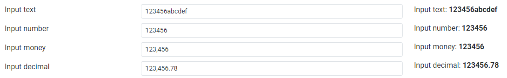

### [AnsInput](/02_WEB/src/components/ans/AnsInput.vue)
This Vue component provides a flexible and customizable input control that can be used in various forms and applications. It supports different types of input, validation, and event handling functionalities.

``` ts
<script setup lang="ts">
    import { ref } from 'vue'
    const exampleValue = ref({
        inputText: '',
        inputNumber: '',
        inputMoney: '',
        inputDecimal: ''
    })
</script>
<template>
    <section id="dashboard" class="container">
        <div class="row">
            <div class="col-sm-8">
                <div class="form">
                    <div class="form-group">
                        <AnsInput  
                            label="Input text"
                            id="inputText"
                            v-model="exampleValue.inputText"
                        />
                    </div>
                    <div class="form-group">
                        <AnsInput
                            label="Input number"
                            id="inputNumber"
                            v-model="exampleValue.inputNumber"
                            type="number"
                        />
                    </div>
                    <div class="form-group">
                        <AnsInput
                            label="Input money"
                            id="inputMoney"
                            v-model="exampleValue.inputMoney"
                            type="money"
                        />
                    </div>
                    <div class="form-group">
                        <AnsInput
                            label="Input decimal"
                            id="inputDecimal"
                            v-model="exampleValue.inputDecimal"
                            type="money"
                            :isDecimal="true"
                        />
                    </div>
                </div>
            </div>
            <div class="col-sm-4">
                <div>
                    <p>
                        Input text: <b>{{ exampleValue.inputText }}</b>
                    </p>
                    <p>
                        Input number: <b>{{ exampleValue.inputNumber }}</b>
                    </p>
                    <p>
                        Input money: <b>{{ exampleValue.inputMoney }}</b>
                    </p>
                    <p>
                        Input decimal: <b>{{ exampleValue.inputDecimal }}</b>
                    </p>
                </div>
            </div>
        </div>
    </section>
</template>
```


### Props
<table>
<thead>
<tr>
<th>Prop's name</th>
<th>Type</th>
<th>Description</th>
</tr>
</thead>
<tbody>
<tr>
<td>type</td>
<td>

`'textarea' | 'number' | 'money' | 'text' | 'tel' | 'email' | 'katakana' | 'alphabet'`, default: `'text'`</td>
<td>Specifies the type of input control.</td>
</tr>
<tr>
<td>id</td>
<td>

`string`, default is a random UUID</td>
<td>The unique identifier of the input control.</td>
</tr>
<tr>
<td>name</td>
<td>

`string`, default have value same with id</td>
<td>The name attribute of the input control.</td>
</tr>
<tr>
<td>label</td>
<td>

`string` (optional)</td>
<td>The label text associated with the input control.</td>
</tr>
<tr>
<td>labelBefore</td>
<td>

`string` (optional)</td>
<td>Text to be displayed before the input field.</td>
</tr>
<tr>
<td>labelAfter</td>
<td>

`string` (optional)</td>
<td>Text to be displayed after the input field.</td>
</tr>
<tr>
<td>placeholder</td>
<td>

`string` (optional)</td>
<td>The placeholder text displayed in the input control.</td>
</tr>
<tr>
<td>itemClass</td>
<td>

`string` (optional)</td>
<td>Additional CSS class for the input control container.</td>
</tr>
<tr>
<td>inputClass</td>
<td>

`string` (optional)</td>
<td>Additional CSS class for the input control.</td>
</tr>
<tr>
<td>labelClass</td>
<td>

`string` (optional)</td>
<td>Additional CSS class for the label associated with the input control.</td>
</tr>
<tr>
<td>isRequired</td>
<td>

`boolean`, default: `false`</td>
<td>Specifies whether the input control is required.</td>
</tr>
<tr>
<td>isDisabled</td>
<td>

`boolean`, default: `false`</td>
<td>Specifies whether the input control is disabled.</td>
</tr>
<tr>
<td>isReadonly</td>
<td>

`boolean`, default: `false`</td>
<td>Specifies whether the input control is readonly.</td>
</tr>
<tr>
<td>maxLength</td>
<td>

`number`, (optional)</td>
<td>

Specifies the maximum number of characters allowed in the input field. If provided, the input field will not accept more characters than the specified `maxLength`.</td>
</tr>
<tr>
<td>isDecimal</td>
<td>

`boolean`, default: `false`</td>
<td>

Specifies whether the input control accepts decimal values. If set to `true`, the input control allows the user to input decimal numbers.</td>
</tr>
<tr>
<td>decimal</td>
<td>

`number`, default: `2`</td>
<td>

Specifies the number of decimal places for numeric inputs. Active when `:isDecimal="true"`</td>
</tr>
<tr>
<td>isNegative</td>
<td>

`boolean`, default: `false`</td>
<td>

Determines whether the input control accepts negative numbers. If set to `true`, the input control allows the user to input negative numbers.</td>
</tr>
<tr>
<td>cols</td>
<td>

`number`, (optional)</td>
<td>

Specifies the visible width of a text area, in terms of the number of average character widths. It represents the visible width of the text area, measured in average character widths. Active when `:type="textarea"`</td>
</tr>
<tr>
<td>rows</td>
<td>

`number`, (optional)</td>
<td>

Specifies the visible height of a text area, in terms of the number of lines. It represents the visible height of the text area, measured in lines. Active when `:type="textarea"`</td>
</tr>
<tr>
<td>isInputGroup</td>
<td>

`boolean`, default: `false`</td>
<td>

Determines whether the input field is part of an input group. When set to `true`, it allows for additional customization such as appending buttons to the input field.</td>
</tr>
<tr>
<td>buttonClass</td>
<td>

`string`, (optional)</td>
<td>

CSS class to apply to the button appended to the input field when `isInputGroup` is set to `true`. Allows for custom styling of the button.</td>
</tr>
<tr>
<td>isDisabledButton</td>
<td>

`boolean`, default: `false`</td>
<td>

Indicates whether the button appended to the input field when `isInputGroup` is set to `true` should be disabled.</td>
</tr>
<tr>
<td>icon</td>
<td>

`string`, (optional)</td>
<td>

The icon class to apply to the button appended to the input field when `isInputGroup` is set to `true`. Allows for displaying an icon alongside the button.</td>
</tr>
<tr>
<td>buttonId</td>
<td>

`string`, default is a random UUID</td>
<td>

The HTML id attribute for the button appended to the input field when `isInputGroup` is set to `true`. It can be used to target the button element for styling or scripting purposes.</td>
</tr>
</tbody>
</table>

### Events
<table>
<thead>
<tr>
<th>Event's name</th>
<th>Params</th>
<th>Description</th>
</tr>
</thead>
<tbody>
<tr>
<td>onChangeEvent</td>
<td>

- `newValue: string | number`
- `oldValue: string | number`: the previous value.
- `event: Event`: the JavaScript event object associated with the change.
</td>
<td>This event is emitted when the value of the input field changes, can be used to perform actions or handle logic based on the input value changes.</td>
</tr>
<tr>
<td>onFocusEvent</td>
<td>

- `event: FocusEvent`: the JavaScript event object associated with the focus event.
</td>
<td>This event is emitted when the input field gains focus, can be used to perform actions or handle logic when the input field receives focus.</td>
</tr>
<tr>
<td>onBlurEvent</td>
<td>

- `event: FocusEvent`: the JavaScript event object associated with the blur event.
</td>
<td>This event is emitted when the input field loses focus, can be used to perform actions or handle logic when the input field loses focus.</td>
</tr>
<tr>
<td>onClickEvent</td>
<td>

- `event: MouseEvent`: the JavaScript event object associated with the click event.
</td>
<td>This event is emitted when the button associated with the input field is clicked, can be used to perform actions or handle logic when the button is clicked.</td>
</tr>
</tbody>
</table>
